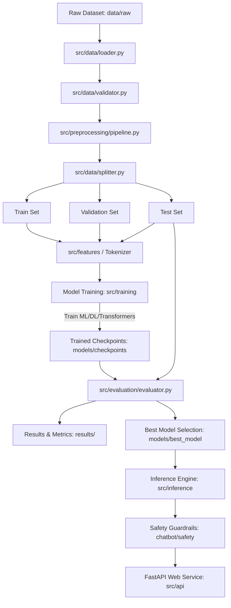

# AI Chatbot for Mental Health — Complete Project Architecture & Structure

> **Degree Project**: MSc Information Technology (Artificial Intelligence) Final Year Project  
> **Project Title**: AI Chatbot for Mental Health — Intent Classification, Emotion Detection & Crisis Awareness System  
> **Architecture Standard**: Production-Ready, Configurable, Research-Oriented ML & Deep Learning Pipeline

---

## 1. Executive Summary & Architectural Design

This document details the software architecture, modular directory design, and execution pipelines for the **AI Chatbot for Mental Health** project. Designed specifically to support rigorous academic research and production-level software standards, the architecture ensures:

- **Strict Separation of Concerns**: Data ingestion, text preprocessing, feature engineering, model training, metrics calculation, API exposure, and safety filtering are fully decoupled.
- **Config-Driven Operations**: Zero hardcoded hyperparameters or dataset paths; all experimental parameters are driven by YAML configurations in `configs/`.
- **Reproducible Machine Learning**: Complete reproducibility guaranteed via deterministic seed initialization (`src/utils/seed.py`), logged configurations, and isolated experiment directories (`experiments/`).
- **Comprehensive Model Benchmarking**: Unified evaluation harness evaluating classic machine learning, deep neural networks (RNN/LSTM/CNN), and Transformer-based models (BERT/RoBERTa/DistilBERT).
- **Safety & Ethical Safeguards**: Dedicated safety and crisis detection layer (`chatbot/safety/`) engineered to identify high-risk distress inputs and trigger immediate intervention protocols.

---

## 2. Directory Tree Visual Layout

```text
ai-chatbot-mental-health/
│
├── README.md                           # Master project documentation & overview
├── PROJECT_STRUCTURE.md                # Comprehensive architecture documentation (this file)
├── requirements.txt                    # Python dependency specifications
├── pyproject.toml                      # Project metadata & build tool configuration
├── .gitignore                          # Git exclude rules for data, models, logs, and artifacts
├── .env.example                        # Environment variable template
├── Dockerfile                          # Container specification for production deployment
├── docker-compose.yml                  # Multi-container orchestration (API + Frontend)
│
├── configs/                            # Centralized YAML configuration files
│   ├── dataset.yaml                    # Dataset paths, schema mapping, and validation rules
│   ├── preprocessing.yaml              # NLP cleaning, normalization, and tokenization settings
│   ├── training.yaml                   # Hyperparameters, batch sizes, learning rates, epochs
│   ├── evaluation.yaml                 # Metrics, decision thresholds, and reporting formats
│   └── models.yaml                     # Model architectures & hyperparameter search spaces
│
├── data/                               # Data storage hierarchy (Git-ignored except README)
│   ├── raw/                            # Original, immutable raw dataset files (.csv, .json)
│   ├── interim/                        # Cleaned & validated intermediate dataset states
│   ├── processed/                      # Preprocessed, tokenized, and split train/val/test datasets
│   ├── external/                       # Third-party lexicons, sentiment dictionaries, embeddings
│   └── README.md                       # Data dictionary & provenance tracking
│
├── notebooks/                          # Sequential, reproducible Jupyter notebooks
│   ├── 01_dataset_analysis.ipynb       # Data inspection, schema verification, missing value audit
│   ├── 02_eda.ipynb                    # Exploratory Data Analysis & visual distribution analysis
│   ├── 03_text_preprocessing.ipynb     # Text cleaning, lemmatization, and stopword experimentation
│   ├── 04_feature_engineering.ipynb    # TF-IDF, Word embeddings, & semantic feature extraction
│   ├── 05_baseline_models.ipynb        # Classic ML baseline model training & evaluation
│   ├── 06_deep_learning_models.ipynb   # LSTM, BiLSTM, and CNN-Text training & validation
│   ├── 07_transformer_models.ipynb     # Fine-tuning BERT, RoBERTa, and DistilBERT models
│   ├── 08_model_comparison.ipynb       # Comparative performance matrix & visual chart generation
│   └── 09_final_evaluation.ipynb       # Error analysis, confusion matrices, and research insights
│
├── src/                                # Core Python source code package
│   ├── __init__.py                     # Package marker
│   │
│   ├── data/                           # Data loading, validation, and PyTorch dataset modules
│   │   ├── __init__.py
│   │   ├── loader.py                   # Dynamic dataset loader supporting multiple formats
│   │   ├── validator.py                # Schema checking, missing value audit, leak detection
│   │   ├── splitter.py                 # Stratified train/val/test data splitter
│   │   └── dataset.py                  # PyTorch Dataset implementations for text & sequences
│   │
│   ├── preprocessing/                  # Text processing & NLP pipelines
│   │   ├── __init__.py
│   │   ├── cleaner.py                  # HTML, emoji, special char, and URL remover
│   │   ├── text_normalizer.py          # Lowercasing, contraction expansion, spell check
│   │   ├── tokenizer.py                # Subword & custom word tokenizers
│   │   ├── stopwords.py                # Custom domain-aware stopword remover
│   │   ├── lemmatizer.py               # POS-tagged NLTK/spaCy lemmatizer
│   │   ├── feature_extraction.py       # Metadata feature extractor (length, punctuation counts)
│   │   └── pipeline.py                 # End-to-end composite preprocessing pipeline
│   │
│   ├── features/                       # Feature representation modules
│   │   ├── __init__.py
│   │   ├── tfidf.py                    # TF-IDF vectorizer wrapper with N-gram configuration
│   │   ├── bow.py                      # Bag-of-Words feature generator
│   │   ├── embeddings.py               # GloVe / FastText dense vector loader & builder
│   │   └── semantic_features.py        # Sentiment scores & intent representation features
│   │
│   ├── models/                         # Model family definitions & neural architectures
│   │   ├── __init__.py
│   │   ├── baseline/                   # Scikit-learn Baseline Models
│   │   │   ├── logistic_regression.py
│   │   │   ├── naive_bayes.py
│   │   │   ├── svm.py
│   │   │   └── random_forest.py
│   │   │
│   │   ├── deep_learning/              # PyTorch Deep Learning Architectures
│   │   │   ├── lstm.py                 # Standard LSTM Classifier
│   │   │   ├── bilstm.py               # Bidirectional LSTM with Attention Mechanism
│   │   │   └── cnn_text.py             # Multi-kernel 1D CNN for Text Classification
│   │   │
│   │   └── transformers/               # Hugging Face Transformer Wrappers
│   │       ├── bert.py                 # BERT-base-uncased fine-tuning model
│   │       ├── roberta.py              # RoBERTa-base classifier wrapper
│   │       └── distilbert.py           # DistilBERT lightweight transformer model
│   │
│   ├── training/                       # Model training execution & optimization engines
│   │   ├── __init__.py
│   │   ├── trainer.py                  # Generic PyTorch/Scikit-learn trainer harness
│   │   ├── train_baseline.py           # Execution module for classic ML models
│   │   ├── train_dl.py                 # PyTorch deep learning training loop with early stopping
│   │   ├── train_transformer.py        # Hugging Face Trainer / PyTorch AdamW fine-tuner
│   │   └── hyperparameter_tuning.py    # Optuna / GridSearch hyperparameter tuning engine
│   │
│   ├── evaluation/                     # Metric calculation & research visualization
│   │   ├── __init__.py
│   │   ├── metrics.py                  # Core metrics: Accuracy, Precision, Recall, F1, Specificity
│   │   ├── confusion_matrix.py         # Confusion matrix generator & heatmap visualizer
│   │   ├── roc_curve.py                # ROC-AUC curve rendering & multi-class AUC handler
│   │   ├── evaluator.py                # Comprehensive evaluator generating dict/JSON summaries
│   │   └── model_comparison.py         # Comparative table builder & ranking generator
│   │
│   ├── inference/                      # Real-time inference & response generation engine
│   │   ├── __init__.py
│   │   ├── predictor.py                # High-speed model inference interface
│   │   ├── chatbot_engine.py           # Dialogue processing & context tracking engine
│   │   └── response_generator.py       # Empathic response assembly & template selector
│   │
│   ├── api/                            # Production REST API Service (FastAPI)
│   │   ├── __init__.py
│   │   ├── main.py                     # FastAPI application entry point & middleware setup
│   │   ├── routes.py                   # API endpoints (/chat, /health, /predict, /metrics)
│   │   └── schemas.py                  # Pydantic request/response data models
│   │
│   ├── utils/                          # System utility modules
│   │   ├── __init__.py
│   │   ├── logger.py                   # Centralized logging configuration
│   │   ├── seed.py                     # Deterministic seed locker (NumPy, PyTorch, Python random)
│   │   ├── device.py                   # Hardware accelerator selector (CUDA, MPS, CPU)
│   │   └── file_utils.py               # JSON/YAML/Pickle file load and save helpers
│   │
│   └── main.py                         # Command-line interface (CLI) entry point for full pipeline
│
├── chatbot/                            # Mental Health Chatbot & Safety Layer
│   ├── prompts/                        # System prompts & conversational templates
│   ├── safety/                         # Safety enforcement sub-system
│   │   ├── crisis_detection.py         # Intent keyword & sentiment crisis triggers
│   │   ├── safety_rules.py             # Harm prevention & out-of-scope intent guardrails
│   │   └── escalation.py               # Emergency helpline & human intervention router
│   └── conversation_manager.py         # Multi-turn session state & history tracker
│
├── models/                             # Saved model weights & serialized artifacts (Git-ignored)
│   ├── checkpoints/                    # Intermediate epoch checkpoints (.pt, .ckpt)
│   ├── tokenizer/                      # Saved subword tokenizers & vocab files
│   ├── vectorizers/                    # Serialized TF-IDF vectorizers & feature scalers (.pkl)
│   └── best_model/                     # Current production-selected model & config bundle
│
├── experiments/                        # Experiment tracking records
│   ├── experiment_001/                 # Run 001 log outputs, metrics, and configs
│   ├── experiment_002/                 # Run 002 log outputs, metrics, and configs
│   └── experiment_003/                 # Run 003 log outputs, metrics, and configs
│
├── results/                            # Research outputs & exportable dissertation assets
│   ├── metrics/                        # JSON/CSV metric reports per model
│   ├── figures/                        # High-resolution PNG/SVG plots for thesis inclusion
│   ├── confusion_matrices/             # Saved confusion matrix graphics
│   ├── roc_curves/                     # Saved ROC curves
│   ├── predictions/                    # Output evaluation predictions (.csv)
│   ├── model_comparison.csv            # Unified model comparison matrix table
│   └── final_report.csv                # Consolidated performance leaderboard
│
├── logs/                               # Application runtime log outputs
│
├── tests/                              # Unit & integration testing suite (Pytest)
│   ├── test_data.py                    # Data validation & dataset loader tests
│   ├── test_preprocessing.py           # NLP cleaner & tokenizer tests
│   ├── test_features.py                # Feature extraction unit tests
│   ├── test_models.py                  # Model forward pass & architecture tests
│   ├── test_evaluation.py              # Metric calculator accuracy tests
│   └── test_api.py                     # API route & Pydantic schema tests
│
└── scripts/                            # One-line execution & utility automation scripts
    ├── prepare_dataset.py              # Script to execute dataset validation & cleaning
    ├── train.py                        # Script to trigger model training pipeline
    ├── evaluate.py                     # Script to evaluate trained model artifacts
    ├── compare_models.py               # Script to compile model benchmark matrix
    └── predict.py                      # Interactive CLI prediction tool
```

---

## 3. Deep-Dive Component Descriptions

### 3.1 Root Configuration & Infrastructure Files
- **`configs/`**: YAML files dictating system parameters.
  - `dataset.yaml`: Specifies dataset filepath, column names (`text_column`, `label_column`), data types, and splitting ratios.
  - `preprocessing.yaml`: Controls lowercasing, stemming vs. lemmatization, stopword removal lists, and max sequence lengths.
  - `training.yaml`: Configures learning rate, optimizer (`AdamW`, `SGD`), batch size, epochs, gradient clipping, and early stopping patience.
  - `evaluation.yaml`: Lists target metrics, decision threshold values, and visualization settings.
  - `models.yaml`: Parameters for SVM kernel choices, Random Forest tree depths, LSTM hidden dimensions, and Transformer pretrained paths (`bert-base-uncased`, etc.).

### 3.2 Data Management Architecture (`data/`)
- **`data/raw/`**: Raw CSV/JSON files. Immutable source of truth.
- **`data/interim/`**: Data after schema validation, deduplication, and missing value treatment.
- **`data/processed/`**: Tokenized, numericalized datasets split into `train.pt`, `val.pt`, and `test.pt` (or equivalent `.csv` partitions).
- **`data/external/`**: Pretrained GloVe vectors, domain lexicons (NRC Emotion Lexicon, VADER lexicons).

### 3.3 Experimental Notebooks Pipeline (`notebooks/`)
Organized sequentially from `01` to `09` to provide a complete, reproducible audit trail for academic review:
1. `01_dataset_analysis.ipynb`: Schema audit, null checks, missing data profiling.
2. `02_eda.ipynb`: Class distributions, word clouds, message length histograms, n-gram frequency distributions.
3. `03_text_preprocessing.ipynb`: Interactive cleaning strategy experimentation.
4. `04_feature_engineering.ipynb`: Comparing TF-IDF, Word2Vec, and dense embeddings.
5. `05_baseline_models.ipynb`: Training and cross-validating Logistic Regression, Naive Bayes, SVM, and Random Forest.
6. `06_deep_learning_models.ipynb`: Training PyTorch LSTM, BiLSTM with Attention, and 1D CNNs.
7. `07_transformer_models.ipynb`: Fine-tuning BERT, RoBERTa, and DistilBERT with Hugging Face.
8. `08_model_comparison.ipynb`: Compiling accuracy, F1-score, latency, and memory footprints into unified charts.
9. `09_final_evaluation.ipynb`: Deep error analysis, edge case testing, and dissertation figure export.

### 3.4 Core Source Package (`src/`)

#### Data Module (`src/data/`)
- `loader.py`: Universal dataset loader handling `.csv`, `.json`, `.parquet`.
- `validator.py`: Automated dataset sanity checks (detects data leakage between train/test, missing values, imbalanced classes).
- `splitter.py`: Stratified train-validation-test split generator preserving class ratios.
- `dataset.py`: PyTorch `Dataset` and `DataLoader` classes for text inputs and model batches.

#### Preprocessing & Features (`src/preprocessing/` & `src/features/`)
- Clean text by removing noise (URLs, HTML tags, special symbols) while preserving sentiment-laden punctuation or emoticons.
- `pipeline.py`: A unified scikit-learn compatible or custom PyTorch `Transform` pipeline executing cleaning $\to$ normalization $\to$ tokenization.
- `features/`: Module generating sparse (TF-IDF, BoW) and dense (GloVe, Sentence-Transformers) feature matrices.

#### Model Zoo (`src/models/`)
Modular implementations categorized into three paradigms:
1. **Baseline Models** (`baseline/`): Fast, highly interpretable scikit-learn models (Logistic Regression, Multinomial Naive Bayes, Support Vector Machines, Random Forest).
2. **Deep Neural Networks** (`deep_learning/`): PyTorch modules:
   - `lstm.py`: Single/Multi-layer LSTM.
   - `bilstm.py`: Bidirectional LSTM with additive self-attention mechanism.
   - `cnn_text.py`: Multi-filter 1D Convolutional Neural Network (Kim CNN architecture).
3. **Transformers** (`transformers/`): Hugging Face `PreTrainedModel` wrappers for BERT, RoBERTa, and DistilBERT fine-tuning.

#### Training & Optimization (`src/training/`)
- `trainer.py`: Abstract Base Class for trainers with standardized callbacks (early stopping, model checkpointing, progress logging).
- `train_dl.py` & `train_transformer.py`: Specialized PyTorch training loops featuring mixed-precision training (`torch.cuda.amp`), AdamW optimizer, and learning rate schedulers.
- `hyperparameter_tuning.py`: Optuna automated hyperparameter optimization integration.

#### Evaluation Engine (`src/evaluation/`)
- Calculates comprehensive performance metrics:
  - Accuracy
  - Precision (Macro, Micro, Weighted)
  - Recall (Sensitivity)
  - F1-Score (Macro, Micro, Weighted)
  - Specificity (True Negative Rate)
  - ROC-AUC (One-vs-Rest for multi-class)
  - Confusion Matrix
  - Training Latency (seconds/epoch) & Inference Latency (milliseconds/sample)
- Generates high-quality Seaborn/Matplotlib figures formatted for inclusion in research reports.

#### Inference & REST API (`src/inference/` & `src/api/`)
- `predictor.py`: Loads the trained model artifact from `models/best_model/` and performs real-time classification.
- `chatbot_engine.py`: Manages dialogue state, maps predicted intent/emotion to empathetic therapeutic responses (Cognitive Behavioral Therapy framework guidelines).
- `api/main.py`: FastAPI server exposing RESTful endpoints for integration with web/mobile UIs.

### 3.5 Chatbot Safety & Crisis Management (`chatbot/`)
Mental health conversational systems demand strict safety guardrails:
- `crisis_detection.py`: Pattern matching and high-confidence distress detection (e.g., self-harm, suicidal ideation, severe panic).
- `safety_rules.py`: Hard rules enforcing non-diagnostic disclaimer compliance and filtering inappropriate responses.
- `escalation.py`: Immediately overrides standard ML model responses during crisis events to present official emergency contacts (e.g., Suicide & Crisis Lifeline, regional helpline numbers).

---

## 4. End-to-End Execution Data Flow



---

## 5. Mental Health Safety Protocol Matrix

| Layer | Component | Function / Responsibility | Failure / Trigger Action |
| :--- | :--- | :--- | :--- |
| **Input Audit** | `crisis_detection.py` | Scans raw input for crisis keywords & intent signals | Immediately flags message as high-risk |
| **ML Intent** | `src/inference/predictor.py` | Classifies mental health state/intent & confidence | Passes prediction & probability score to dialogue engine |
| **Policy Check** | `safety_rules.py` | Validates model output against medical disclaimer rules | Rejects unverified advice; injects standard disclaimers |
| **Escalation** | `escalation.py` | Overrides ML engine during crisis detections | Returns immediate helpline resources & emergency protocol |

---

## 6. Execution Quickstart Guide

### 6.1 Environment Setup
```bash
# Clone repository & navigate to directory
cd c:/Users/UDIT/Project/Ai-chatbot-mental-health

# Create virtual environment
python -m venv venv

# Activate virtual environment (Windows PowerShell)
# Note: If PowerShell blocks script execution, run: Set-ExecutionPolicy -ExecutionPolicy RemoteSigned -Scope Process
Set-ExecutionPolicy -ExecutionPolicy RemoteSigned -Scope Process
venv\Scripts\activate

# Install dependencies
pip install -r requirements.txt
```

### 6.2 Full Pipeline Execution
```bash
# 1. Dataset Preparation & Cleaning
python scripts/prepare_dataset.py --config configs/dataset.yaml

# 2. Train Models (Baseline, Deep Learning, or Transformers)
python scripts/train.py --config configs/training.yaml --model bilstm

# 3. Model Evaluation
python scripts/evaluate.py --model-dir models/best_model --test-data data/processed/test.pt

# 4. Model Benchmarking & Comparison Matrix
python scripts/compare_models.py --results-dir results/metrics

# 5. Launch FastAPI Backend Service
uvicorn src.api.main:app --host 0.0.0.0 --port 8000 --reload
```

---

## 7. Verification & Testing Standards

All software components must pass strict automated test coverage:

```bash
# Run unit and integration test suite
pytest tests/ -v --cov=src
```

- **Data Integrity Tests**: `tests/test_data.py` verifies zero overlap between train and test splits.
- **Preprocessing Tests**: `tests/test_preprocessing.py` ensures deterministic cleaning without dropping critical text.
- **Model Tests**: `tests/test_models.py` verifies tensor shapes across network layers for all model families.
- **Safety Tests**: `tests/test_api.py` and safety tests guarantee crisis escalation triggers fire correctly.
